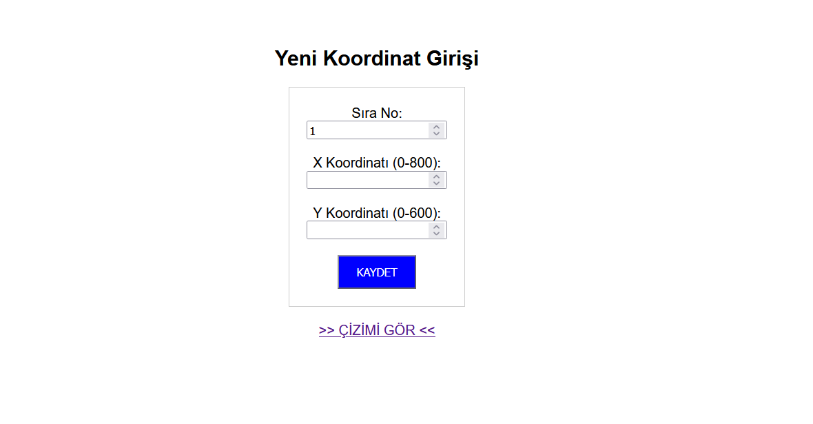
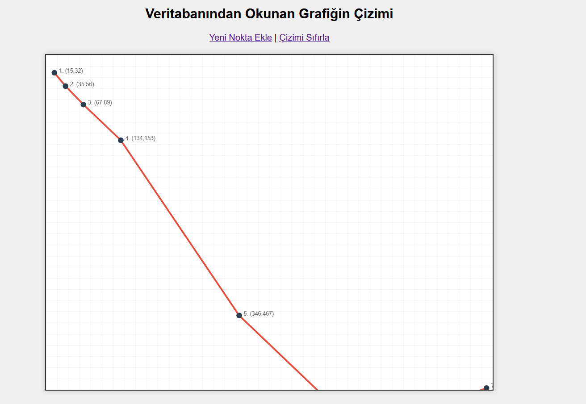
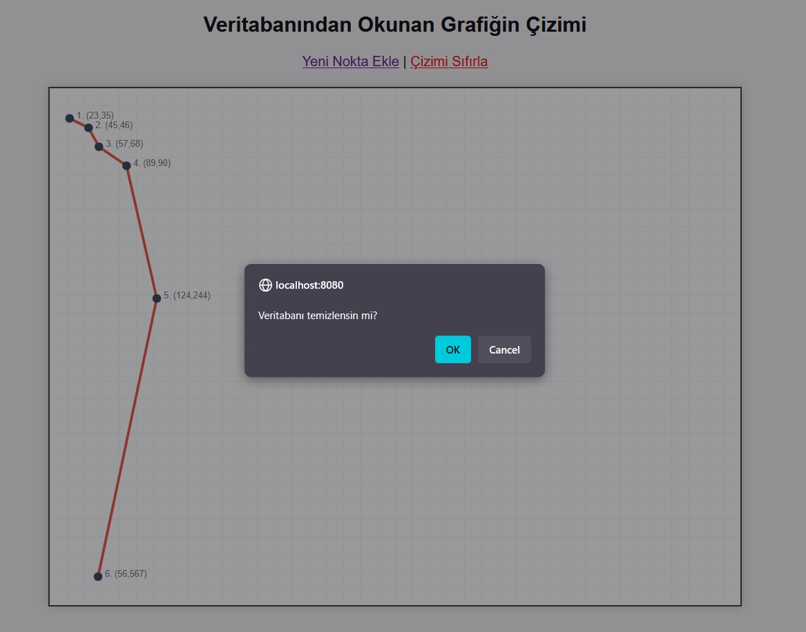
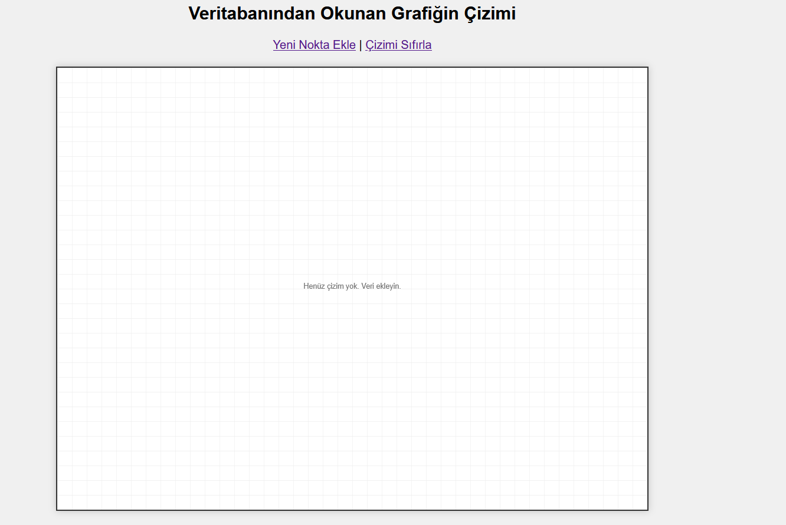

# 📈 ASP ile Dinamik Koordinat ve Grafik Çizim Sistemi

Bu proje, **Classic ASP (Active Server Pages)** ve **Microsoft Access** veritabanı kullanılarak geliştirilmiş bir grafik çizim uygulamasıdır. Kullanıcıdan alınan 2D koordinat verilerini (X, Y) veritabanına kaydeder ve bu verileri işleyerek HTML5 **SVG (Scalable Vector Graphics)** teknolojisi ile dinamik olarak ekrana çizer.

## 🚀 Proje Özellikleri

* **Veri Girişi:** Kullanıcı X ve Y koordinatlarını ve çizim sırasını (Sıra No) sisteme girer.
* **Veritabanı Entegrasyonu:** Girilen veriler Microsoft Access (.mdb) veritabanında kalıcı olarak saklanır.
* **Dinamik Çizim (SVG):** `ciz.asp` sayfası, veritabanındaki noktaları sırasına göre okur ve `<polyline>` kullanarak şekli oluşturur.
* **Görselleştirme:** Her koordinat noktası üzerinde görsel işaretleyici ve koordinat bilgisi yer alır.
* **Veri Yönetimi:** Veritabanındaki çizim verileri "Çizimi Sıfırla" butonu ile tek tıkla temizlenebilir.

## 🛠 Kullanılan Teknolojiler

* **Backend:** Classic ASP (VBScript)
* **Veritabanı:** Microsoft Access (.mdb)
* **Frontend:** HTML5, CSS3
* **Grafik Motoru:** SVG (Scalable Vector Graphics)

## 📂 Dosya Yapısı

```text
Proje_Klasoru/
│
├── db/
│   └── veritabani.mdb    <-- (Veritabanı Dosyası)
│
├── index.asp             <-- (Veri giriş formu)
├── ekle.asp              <-- (Veriyi kaydeden işlem sayfası)
├── ciz.asp               <-- (Grafiği çizen ana sayfa)
├── temizle.asp           <-- (Veritabanını sıfırlayan kod)
└── README.md             <-- (Proje dökümantasyonu)
```
## ⚙️ Kurulum ve Çalıştırma

Bu proje veritabanına yazma işlemi yaptığı için klasör izinlerinin doğru ayarlanması gerekmektedir.

    Sunucu: Baby Web Server veya IIS (Internet Information Services) üzerinde çalıştırılabilir.

    Tarayıcınızda http://localhost/index.asp adresine giderek koordinat girmeye başlayabilirsiniz.

## 💾 Veritabanı Şeması (Noktalar Tablosu)


## 📸 Ekran Görüntüleri Kullanım Senaryosu

| **1. Ana Sayfa (Giriş)** | **2. Koordinat Verisi Eklendikten sonra Grafik** |
| :---: | :---: |
|  |  |

**3. Veritabanı Temizlenmeden Önceki Onay Sorusu** 


**4. Boş Veritabanı Olduğunda Grafik**



